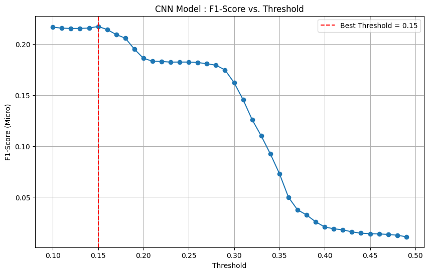
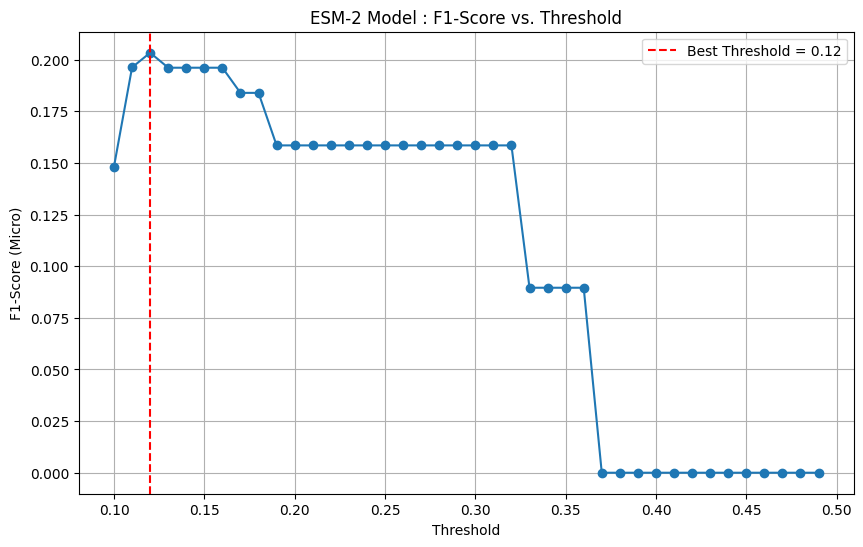

# Predicting Protein Function: A Comparison of CNN and Transformer Models

## Project Summary
This project investigates the prediction of protein functions (Gene Ontology terms) from their amino acid sequences. We implemented and compared two deep learning architectures: a custom 1D Convolutional Neural Network (CNN) as a baseline, and a fine-tuned, pre-trained Transformer model (ESM-2).

The key finding is nuanced: while the simpler 1D-CNN achieved a slightly higher AUC score (0.80), indicating better overall ranking ability, the fine-tuned ESM-2 Transformer yielded a better F1-Score (0.20) after its decision threshold was optimized. This demonstrates the real-world trade-offs between model architecture and evaluation metrics.

---

## Dataset

The data was sourced from the [UniProt](https://www.uniprot.org/) database and consists of protein sequences from the *Saccharomyces cerevisiae* (yeast) organism.

* **Filtering:** Only reviewed proteins (Swiss-Prot) with experimentally validated GO terms were used.
* **Labels:** The top 1,000 most frequent GO terms were selected as the target labels.
* **Final Size:** The final dataset contains 5,947 protein sequences.

### Data File
The final, pre-processed data used in the notebook is stored in the file: `uniprotkb_reviewed_true_AND_organism_id_2025_07_29.tsv.gz`.

This is a tab-separated file containing the following key columns:
* **`Entry` / `Entry Name`**: Unique identifiers for the protein.
* **`Sequence`**: The amino acid sequence.
* **`Gene Ontology (GO)`**: A text string containing the functional annotations.

---

## Models and Methodology

### 1. Baseline Model: 1D-CNN
A 1D-CNN was built from scratch using TensorFlow/Keras. The architecture consists of:
- An Embedding layer to learn representations for each amino acid.
- A `Conv1D` layer to detect sequence motifs.
- A `GlobalMaxPooling1D` layer.
- A final `Dense` layer with a sigmoid activation for multi-label prediction.

### 2. Advanced Model: ESM-2 Transformer
We used a pre-trained protein language model, `facebook/esm2_t6_8M_UR50D`, from the Hugging Face library.
- **Fine-Tuning:** A new classification head was added to the model, and it was fine-tuned for 8 epochs on our specific dataset.
- **Training:** The fine-tuning process was managed using the Hugging Face `Trainer` API.

---

## Results
The performance of both models was evaluated on a held-out test set.

| Metric                  | Baseline Model (1D-CNN) | Transformer (ESM-2) |
| :---------------------- | :---------------------- | :-------------------- |
| **AUC (Micro)** | 0.8015               | 0.7903
| **Best F1-Score (Micro)** | 0.2066                  | 0.2033 |
| **Optimal Threshold** | 0.15            | 0.12                  |

#### Threshold Optimization Analysis

The plots below show how the F1-Score for each model changes with different decision thresholds.

**1. CNN Model Optimization**

**2. Transformer Model Optimization**

This analysis clearly shows the optimal operating point for each model and highlights the importance of post-training optimization.
---

## Discussion and Conclusion

After optimizing the decision thresholds for both models, we arrived at a clear and insightful conclusion: for this specific task and dataset, the simpler **1D-CNN baseline model performed slightly better than the pre-trained ESM-2 Transformer on *both* primary evaluation metrics.**

-   **Ranking Ability (AUC):** The CNN achieved a slightly higher AUC score (0.8015 vs. 0.7903), indicating a better overall ability to distinguish between correct and incorrect protein-function pairings.
-   **Predictive Performance (F1-Score):** The CNN also achieved a higher peak F1-Score after its threshold was optimized (0.2066 vs. 0.2033).

This counter-intuitive result is highly valuable and suggests several possibilities:

1.  **Dataset Size:** The dataset, while clean, may be too small (~6,000 proteins) for a large pre-trained model like ESM-2 to leverage its full potential during fine-tuning. The complexity of the Transformer might be under-utilized.
2.  **Architecture Suitability:** 1D-CNNs are exceptionally good at detecting small, local patterns or "motifs" in sequences. It is likely that many protein functions are strongly associated with these types of short, conserved regions, making the CNN a very efficient and effective architecture for this problem.
3.  **Model Version:** We used a smaller version of the ESM-2 model (8M parameters). It is possible that a larger, more powerful version could have yielded better results, albeit at a significantly higher computational cost.

In conclusion, this project strongly demonstrates the importance of establishing strong, well-tuned baselines. It shows that for specific, smaller-scale bioinformatics tasks, a tailored and efficient architecture like a 1D-CNN can be more effective than a general-purpose, large-scale language model.

---

## Future Work
- Fine-tuning larger versions of the ESM-2 model.
- Applying more advanced class-imbalance handling techniques during training.
- Using model interpretation techniques (like attention maps from the Transformer) to understand which parts of the protein sequence are important for predicting function.

## Contact
* **Author:** Hosein Mohammadi
* **Date:** July 2024
* **Contact:** [huseinmohammadi83@gmail.com](mailto:huseinmohammadi83@gmail.com)
* **LinkedIn:** [Hosein Mohammadi](https://www.linkedin.com/in/hosein-mohammadi-979b8a2b2/) 
